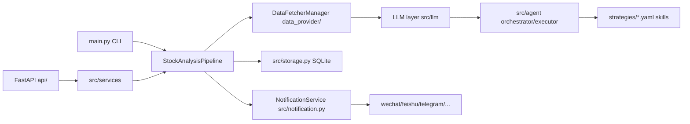

# Repository Guidelines

Guidelines for working in **daily_stock_analysis (DSA)** — the AI LLM stock-analysis system.
This file is the canonical source for repository AI-collaboration rules; `CLAUDE.md` must remain a symlink to it
(enforced by `scripts/check_ai_assets.py`). When this file conflicts with scripts, workflows, or code, trust the
executable reality and fix the doc in the same change.

## Project Overview

- **Purpose**: LLM-driven stock analysis for A-share / HK / US / JP / KR / TW markets. Runs a daily pipeline that
  fetches market data, performs technical/news/fundamental analysis, generates an AI "decision dashboard" report,
  and pushes it to WeChat Work / Feishu / Telegram / Discord / Slack / email.
- **Main flow**: `fetch data → technical analysis + news search → LLM analysis → report generation → notification`.
- **Runtime modes** (all reachable from `main.py`): one-shot stock analysis, daily scheduled run, market review
  (`大盘复盘`), and Web UI / API serving. Also runs as a FastAPI service, Docker containers, GitHub Actions daily
  workflow, or Electron desktop app.
- **Markets**: A (CN), HK, US, JP, KR, TW. Multi-market, multi-data-source with fallback chains; free sources
  (AkShare/Baostock/YFinance) work zero-config, token sources (TickFlow/Tushare/Longbridge) add stability.

## Architecture & Data Flow

Monolithic Python backend with a FastAPI control plane, plus React and Electron frontends.



- **Per-stock pipeline** (`src/core/pipeline.py`, `StockAnalysisPipeline`):
  `fetch + save daily data` → `analyze_stock` (realtime quote → chip distribution → optional agent mode →
  trend analysis → intel news search → social sentiment (US) → LLM generation → integrity checks → guardrails) →
  `save_analysis_history` → single-stock or merged notification. Per-stock exceptions are caught → `None`; one
  failure never aborts the batch. Concurrency is a `ThreadPoolExecutor` with `max_workers` ≈ 3 (anti-scraping).
- **Market review** (`src/core/market_review.py` → `src/market_analyzer.py`): multi-region (cn/hk/us/jp/kr)
  index overview + sector/news + LLM report, persisted as `market_review_YYYYMMDD.md`, under a file lock
  (`src/core/market_review_lock.py`) so CLI/API cannot run it concurrently. Re-raises `GenerationError`, else fail-open.
- **LLM backends** (`src/llm/`): a `GenerationBackend` `typing.Protocol` with pluggable implementations —
  `litellm` (default), local CLI presets (`codex_cli` / `claude_code_cli` / `opencode_cli`), and a reserved local
  Hermes channel. Selected via env (`AGENT_BACKEND`/`GENERATION_*`), resolved by `backend_registry.resolve_*`,
  constructed by `backend_factory.create_generation_backend`. `GenerationError` carries `error_code/stage/
  retryable/fallbackable`.
- **Agent layer** (`src/agent/`): two interchangeable executors chosen by `AGENT_ARCH` — legacy single-agent
  `AgentExecutor` (ReAct) and `AgentOrchestrator` (multi-agent: Technical → Intel → Risk → Specialist → Decision).
  Both share `run_agent_loop` (`runner.py`), a `ToolRegistry` (~30 `ToolDefinition`s across data/analysis/search/
  market/backtest), and YAML/SKILL.md-defined skills loaded from `strategies/`. Chat streams to WebUI as SSE
  (`stream_events.py` flat dicts over `text/event-stream` endpoints).
- **Config system**: env-driven `Config` singleton (`src/config.py`, `get_config()`), loaded from `.env`
  (`ENV_FILE` overrides the path). WebUI settings write through `SystemConfigService`
  (`src/services/system_config_service.py`) → `ConfigManager.apply_updates` (`src/core/config_manager.py`, atomic
  temp-file + `os.replace` rewrite, optimistic `config_version` token) → hot reload via `Config.reset_instance()` +
  runtime scheduler reconciliation. UI metadata (field defs, categories, sensitivity) lives in
  `src/core/config_registry.py` (`SCHEMA_VERSION`).
- **Persistence**: SQLAlchemy 2.x ORM over SQLite. All ~35 ORM models are defined in `src/storage.py`
  (`Base = declarative_base()`), accessed via the `DatabaseManager` singleton (WAL, busy timeout, write-retry loop,
  hand-rolled idempotent `_ensure_*` migrations, UTC-naive datetimes). Repositories in `src/repositories/` are thin
  query layers (`XxxRepository`), with `BEGIN IMMEDIATE` write serialization in `portfolio_repo.py`.
- **Notification**: `NotificationService` (`src/notification.py`) is a mixin over 14 plain `XxxSender(config)`
  classes; routes filtered by `notification_routing.py`, capability profiles in `notification_capabilities.py`,
  noise control (dedup/cooldown/quiet-hours/min-severity) in `notification_noise.py`. Markdown → PNG via
  `src/md2img.py` (wkhtmltoimage → m2f → playwright fallback) and HTML posters via `src/share_image.py`.

## Key Directories

| Path | Purpose |
|---|---|
| `main.py` / `server.py` / `webui.py` | CLI orchestrator; uvicorn entry (`api.app:app`); web-only launcher |
| `src/core/` | Pipeline, market review, trading calendar, config registry/manager, backtest engine |
| `src/services/` | ~60 business services: system config, task queue, screening, agent chat, report rendering |
| `src/llm/` | Generation backends (litellm / local CLI / hermes), provider cache, usage accounting |
| `src/agent/` | Agent orchestrator/executor, tools registry, skills engine, SSE stream events |
| `src/repositories/` | SQLAlchemy data-access layer over `src/storage.py` models |
| `src/schemas/` | Pydantic v2 / Literal / frozen-dataclass contracts (decision action, report, market) |
| `api/` | FastAPI app factory, `/api/v1` endpoint routers, auth/error middlewares, DI (`deps.py`) |
| `data_provider/` | Market-data fetchers + `DataFetcherManager` fallback routing, field standardization |
| `bot/` | Chat-bot webhook adapters (`platforms/`), command dispatcher, `commands/` |
| `apps/dsa-web/` | React 19 + Vite 7 + TS frontend (builds to repo-root `static/`) |
| `apps/dsa-desktop/` | Electron 31 desktop app wrapping a PyInstaller-frozen backend |
| `tests/` | pytest suite (~250 files), incl. `tests/agent/`; mirrors module names |
| `scripts/` | CI gates (`ci_gate.sh`, `test.sh`), packaging (.ps1/.sh), stock-index & data scripts, diagnostics |
| `.github/` | Workflows (CI, daily analysis, releases, PR review), `scripts/`, `instructions/` |
| `docs/` | Guides (zh primary, `*_EN.md` mirrors), `CHANGELOG.md`, `INDEX.md` doc hub |
| `strategies/` | YAML strategy-skill packs (auto-loaded as agent "skills") |
| `templates/` | Jinja2 report templates (`report_{markdown,wechat,brief}.j2`, `_macros.j2`) |
| `docker/` | `Dockerfile` (multi-stage node→python:3.11-slim-bookworm), `docker-compose.yml`, `entrypoint.sh` |
| `.claude/skills/` | Repo-committed collaboration skills (analyze-issue / analyze-pr / fix-issue) |

## Development Commands

```bash
# Setup
pip install -r requirements.txt
cp .env.example .env          # then edit; config is env-driven

# Run analysis (CLI)
python main.py                                # analyze STOCK_LIST
python main.py --stocks 600519,hk00700,AAPL   # override stock list
python main.py --market-review                # 大盘复盘 only
python main.py --schedule                     # daily scheduled runs (18:00)
python main.py --serve / --serve-only         # start API server (+ keep analysis)
python main.py --webui / --webui-only         # alias of --serve / --serve-only
python main.py --dry-run --no-notify          # fetch data only, no LLM/notify
python main.py --debug | --force-run | --single-notify | --no-market-review
python main.py --backtest --backtest-code <code> --backtest-days 30

# API server
uvicorn server:app --reload --host 0.0.0.0 --port 8000

# Backend validation (canonical pre-PR gate)
./scripts/ci_gate.sh [all|syntax|flake8|deterministic|offline-tests]
python -m py_compile <changed_python_files>        # minimal syntax check
python -m pytest -m "not network" --timeout=120 -o timeout_method=thread
python scripts/check_env.py                          # .env / provider / LLM / notify diagnostics

# CLI smoke scenarios (not pytest)
./scripts/test.sh [market|a-stock|etf|hk-stock|us-stock|mixed|single|dry-run|full|quick|code|yfinance|syntax|flake8|all]

# Web frontend
cd apps/dsa-web && npm ci && npm run lint && npm run build
cd apps/dsa-web && npm test                          # vitest; npm run test:smoke = playwright

# Desktop (build web first, then Electron)
cd apps/dsa-desktop && npm install && npm run build

# Docker
docker compose -f docker/docker-compose.yml up -d    # services: analyzer (scheduled) + server (FastAPI)

# AI asset governance (after touching AGENTS.md / CLAUDE.md / .github instructions / .claude/skills)
python scripts/check_ai_assets.py
```

## Code Conventions & Common Patterns

- **Formatting / lint**: black with `line-length = 120` (`pyproject.toml`); isort `profile = black`; flake8
  `max-line-length = 120`, ignores `E501,W503,E203,E402` (`setup.cfg`). CI flake8 runs critical codes only:
  `--select=E9,F63,F7,F82`.
- **Naming**: services `XxxService`, repositories `XxxRepository`, fetchers `XxxFetcher`, senders `XxxSender`,
  providers `XxxProvider`, backends `XxxGenerationBackend`; module-level constants `UPPER_SNAKE`; private helpers
  `_leading_underscore`; env keys `SCREAMING_SNAKE` with namespaced families (`LLM_*`, `AGENT_*`, `GENERATION_*`,
  `NOTIFICATION_*`, `*_PRIORITY`, `*_API_KEYS`).
- **File headers**: `# -*- coding: utf-8 -*-` + module docstring. Legacy files use Chinese `====` banners;
  new modules use English docstrings and `from __future__ import annotations`. Comments/docstrings/log text are
  not required to be English — match the file's language.
- **Typing**: pydantic v2 for LLM-facing and API schemas (`src/schemas/`, `api/v1/schemas/`); `@dataclass(frozen=True)`
  for immutable contracts; `Literal` for enum-like values; `typing.Protocol` for structural interfaces
  (`GenerationBackend`, `AgentBackend`); `Optional[X]` and `X | None` both accepted (mixed legacy/new).
- **Error handling — fail-open**: optional services wrap init/calls in `try/except Exception` and degrade to
  `None`/empty/fallback with `logger.warning`; a single provider, channel, or stock failure must NOT break the main
  flow (unless fail-fast is explicitly required). Core paths (all daily-data sources failing) raise typed errors
  like `DataFetchError`. Custom exceptions carry structured payloads (`GenerationError` with `error_code/stage/
  retryable/fallbackable`, `ConfigValidationError(issues)`, `PortfolioBusyError`). API errors use the uniform body
  `{"error", "message", "detail"}` (`api/v1/errors.py`). Log with `logger.exception` inside except blocks.
- **Async model**: sync-first. FastAPI handlers are mostly `def` (blocking work runs in Starlette's threadpool);
  only SSE / auth / health are `async def`. Analysis concurrency is threads (`ThreadPoolExecutor`), scheduler
  background tasks are daemon `threading.Thread`; async bridges via `asyncio.to_thread`. Guard shared state with
  `threading.RLock`; request-scoped state via `ContextVar`.
- **Dependency injection**: constructor injection with optional singleton default
  (`def __init__(self, db_manager: Optional[DatabaseManager] = None)`); legacy classmethod singletons
  (`TaskService.get_instance()`, `DatabaseManager.get_instance()`, `get_db()`); FastAPI DI in `api/deps.py`
  (request-scoped services cached on `request.app.state`). Use lazy function-level imports to break circular deps.
  Note: `src/services/__init__.py` lazy-re-exports only 6 names — import other services from their submodules.
- **State management**: single env-driven `Config` singleton; SQLite via `DatabaseManager`; repositories are thin;
  `.env` writes are optimistic-concurrency (config_version). ORM models all live in `src/storage.py` — do not add
  models elsewhere.
- **Fallback pattern**: ordered provider lists with numeric priority (smaller = first; env-tunable `*_PRIORITY`),
  tenacity retries (`stop_after_attempt(3)`, exponential wait), `CircuitBreaker` for unhealthy sources, per-run
  diagnostics via `record_provider_run`. Never hardcode a chain that ignores `*_PRIORITY` env vars.
- **Notification contract** for new channels: add a plain `XxxSender(config)` with `send_to_xxx(content, *, timeout_seconds=...)`,
  then register in `notification_sender/__init__.py`, the `NotificationService` mixin list, `NotificationChannel`,
  `_send_to_static_channel`, `ChannelProfile`, and the route channel tuple.
- **Bot contract** for new commands/platforms: subclass `BotCommand` → add to `bot/commands/__init__.py
  ALL_COMMANDS`; subclass `BotPlatform` → register in `bot/platforms/__init__.py ALL_PLATFORMS`.

## Important Files

| Path | Why it matters |
|---|---|
| `main.py` | CLI orchestrator: arg parsing, serve/schedule/backtest/market-review modes, `run_full_analysis`, API bootstrap |
| `server.py` / `webui.py` | uvicorn entry (`api.app:app`); standalone Web-UI launcher |
| `api/app.py` | FastAPI factory: CORS, auth + error middlewares, `/api/v1` router, health, SPA/static serving, lifespan services |
| `api/v1/router.py` | Aggregates endpoint routers (auth, analysis, history, stocks, backtest, system, agent, portfolio, screening, decision-signals, usage, alerts, intelligence) |
| `src/core/pipeline.py` | `StockAnalysisPipeline` — the per-stock fetch→analyze→report→notify engine |
| `src/core/market_review.py` | `run_market_review` — multi-region market-review report + persistence + notification |
| `src/core/trading_calendar.py` | Market region inference, open/trading-day checks, market-phase context |
| `src/config.py` | `Config` singleton dataclass + `setup_env()` (.env loading, precedence, validation) |
| `src/core/config_registry.py` | WebUI config schema metadata (categories, field defs, sensitivity, hidden keys) |
| `src/core/config_manager.py` | Atomic `.env` read/write with optimistic versioning + compose escaping |
| `src/storage.py` | `DatabaseManager` singleton + ALL ORM models + persistence API (SQLite) |
| `src/analyzer.py` | `GeminiAnalyzer` (LiteLLM) + `AnalysisResult` + prompt/JSON parsing/integrity fills |
| `src/market_analyzer.py` | `MarketAnalyzer` — index overview, stats, sectors, news, LLM market review + market-light snapshot |
| `src/llm/backend_registry.py` / `backend_factory.py` | Backend id constants + resolution; `create_generation_backend()` |
| `src/agent/orchestrator.py` / `factory.py` | Multi-agent pipeline; single construction point `build_agent_executor` |
| `src/services/system_config_service.py` | WebUI settings read/validate/update; `.env` persistence flow |
| `data_provider/base.py` | `DataFetcherManager` fallback routing; `STANDARD_COLUMNS`; code normalization |
| `src/notification.py` | `NotificationService` mixin + report builders + dispatch |
| `src/search_service.py` | News-search providers with fallback order + tenacity retries |
| `scripts/ci_gate.sh` / `scripts/test.sh` | Canonical backend gate; CLI smoke driver |
| `scripts/check_ai_assets.py` | Enforces AGENTS.md/CLAUDE.md symlink + `.github` instructions + `.claude/skills` contract |
| `strategies/*.yaml` | Strategy-skill packs (authoring spec in `strategies/README.md`) |
| `templates/report_*.j2` | Jinja2 report templates rendered by `src/services/report_renderer.py` |
| `.env.example` | Canonical env-var reference (~20 grouped sections; update it when config semantics change) |
| `setup.cfg` / `pyproject.toml` | flake8/pytest/isort/black/bandit config |

## Runtime / Tooling Preferences

- **Python**: 3.10+ floor; CI and Docker use **3.11**; desktop PyInstaller packaging uses **3.12**. The repo is
  **not a pip package** — `pyproject.toml` is tooling-only (no `[project]`/`[build-system]`); run from the repo root.
- **Package managers**: `pip` + `requirements.txt` (runtime) and `.github/requirements-ci.txt` (CI test deps);
  `npm ci` for the web app (engines: `node >=20.19 <27`, `npm >=10`).
- **Code tooling**: black (120), isort (black profile), flake8 (120, ignores E501/W503/E203/E402), bandit (skips
  B101 in tests). CI lint gate is flake8 criticals `E9,F63,F7,F82` only.
- **Config**: everything is env-driven (`.env`; `ENV_FILE` overrides path). Never hardcode secrets, accounts, ports,
  model names, or environment-specific paths; new config keys MUST be added to `.env.example`.
- **Docker**: multi-stage (node:20-slim web builder → python:3.11-slim-bookworm), non-root user `dsa` (UID 1000),
  `docker-compose.yml` runs two services of one image: `analyzer` (scheduled) and `server`
  (`main.py --serve-only`). TZ `Asia/Shanghai`.
- **Git discipline**: never `git commit` / `git tag` / `git push` without explicit user confirmation. Before
  PR creation/update, PR review, or issue analysis: `git fetch --all --prune`, then `git pull --ff-only` only when
  the worktree is clean and fast-forwardable — otherwise analyze against fetched remote refs and record the baseline
  gap. Auto-tagging is opt-in (`#patch` / `#minor` / `#major` in commit title).

## Testing & QA

- **Framework**: pytest (`setup.cfg [tool:pytest]`, `testpaths = tests`, `addopts = -v --tb=short`). Markers
  declared: `unit`, `integration`, `network` — in practice only `network` is used. ~250 test files incl.
  `tests/agent/`; legacy tests are `unittest.TestCase`, newer ones use pytest fixtures (`tmp_path`, `monkeypatch`,
  `caplog`, `@pytest.mark.parametrize`).
- **`tests/conftest.py` is not fixtures** — it is an asyncio/AnyIO/TestClient compatibility shim (single-thread
  `_ThreadlessTestClient` replacing `fastapi.testclient.TestClient`). Do not remove or "simplify" it.
- **Canonical gate**: `./scripts/ci_gate.sh` = `py_compile` on key modules → flake8 criticals → `test.sh code` +
  `test.sh yfinance` (inline assertions) → `pytest -m "not network" --timeout=120 -o timeout_method=thread
  -o faulthandler_timeout=300`. CI runs this in 3 duration-balanced shards via `scripts/ci_test_shard.py` +
  `.github/ci-test-durations.json` (no pytest-xdist). Update the durations file when adding heavy test files.
- **Network isolation**: mock at the HTTP boundary — module-level `@mock.patch("...requests.post")`, `sys.modules`
  fakes for `litellm`/`akshare`/`json_repair`, `monkeypatch.setenv`. DB isolation via `sqlite:///:memory:` /
  `tmp_path` DBs plus singleton resets (`DatabaseManager.reset_instance()`, `Config.reset_instance()`). Real risk
  layers that ARE exercised offline: SQLite schema migrations, FastAPI auth stack, subprocess lifecycle, packaging
  assets, and CI wiring itself (`tests/test_ci_workflow_contract.py`).
- **Network-marked tests** (`@pytest.mark.network`): only `tests/test_anspire_search.py` and
  `tests/test_tw_institutional_network.py`; run in the non-blocking cron `network-smoke.yml`
  (`pytest -m network` + `./scripts/test.sh quick --no-notify`). Live-drift detector:
  `tests/tw_institutional_live_smoke.py` (manual, deliberately not pytest-collected).
- **Coverage**: none measured — no `--cov`, no `fail_under`. Don't claim coverage numbers.
- **Review contract**: mocking a real risk layer (e.g. stubbing the whole fetch) must be paired with either an
  offline real-stack test or a `network`-marked live check. Fix review feedback across the full contract (runtime,
  API/Web, docs, workflows, tests), never as a one-line patch.

## Repository Governance & Contribution Rules

- **AI asset governance**: `AGENTS.md` is the single source of truth for AI-collaboration rules; `CLAUDE.md` must
  remain a symlink to it; `.github/copilot-instructions.md` and `.github/instructions/*.instructions.md` mirror it
  (`applyTo:` globs scope them per path); repo skills live in `.claude/skills/`; `.claude/reviews/` is a local
  artifact (never committed). Run `python scripts/check_ai_assets.py` after touching these. If a future agent dir
  is added, mirror via script from one source — no hand-maintained duplicates.
- **Scope discipline**: respect directory boundaries (backend `src/`+`data_provider/`+`api/`+`bot/`, web
  `apps/dsa-web/`, desktop `apps/dsa-desktop/`, deploy `.github/workflows/`+`scripts/`+`docker/`). Reuse existing
  modules, config entrypoints, scripts, and tests — no parallel implementations. Stability first: no unrelated
  refactors, no low-quality "line-count" contributions.
- **PR titles**: `<type>: <summary>` with `fix`/`feat`/`refactor`/`docs`/`chore`/`test`/`ci`; no `[codex]`/
  `codex`/`autocode`/`copilot` or tool prefixes (process guidance, not a hard blocker).
- **CHANGELOG** (`docs/CHANGELOG.md`): `[Unreleased]` uses a **flat format** — one `- [类型] 描述` line per change
  (`新功能`/`改进`/`修复`/`文档`/`测试`/`chore`), **no `###` subheadings** in `[Unreleased]` (enforced by tests).
- **Docs**: `README.md` stays homepage-level; detail goes in `docs/*.md` (`docs/INDEX.md` is the hub). Primary docs
  are Simplified Chinese with `*_EN.md` mirrors; when updating only one language version, explain why the
  counterpart was not synced. New/changed config keys → sync `.env.example`.
- **User-visible changes** (CLI/API, deploy, notification, report structure, report rendering, Web UI): update docs +
  `docs/CHANGELOG.md`, and PR descriptions must include screenshots/visual evidence (in the PR, not committed files).
  Changing `EXTRACT_PROMPT` in `src/services/image_stock_extractor.py` requires attaching the full latest prompt.
- **Delivery contract**: default final summary covers what changed / why / verification / unverified items / risks /
  rollback. Validation by change area — backend: `./scripts/ci_gate.sh` (min `py_compile`); web: `npm ci && npm run
  lint && npm run build`; desktop: build web then Electron; docs/workflows: verify commands, paths, workflow names,
  and config keys match the repo; network/third-party changes: run offline/deterministic checks and state why any
  online validation was skipped.
- **Skills**: for issue analysis, PR review, or issue fixing, prefer `.claude/skills/analyze-issue`,
  `.claude/skills/analyze-pr`, `.claude/skills/fix-issue` and write artifacts under `.claude/reviews/`. Review order:
  necessity → relevance → title → description completeness → validation evidence → implementation correctness →
  merge decision. Blockers: correctness/security issues, blocking CI failure, PR body contradicting the diff,
  missing rollback, or repeated contract drift.
